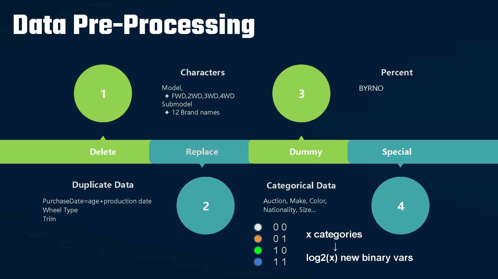

# machine-learning-car-data-analysis-with-rmd
using r markdown
  
This is a group project for a course. The purpose of this project is to learning the philosophy between cars tradings. The original data is collected from kaggle [Don't get kicked!](https://www.kaggle.com/c/DontGetKicked), which is the same as csv files in orinigal_data folder. 
  
It is a practise of employing machine learning methods. The original kaggle test has already closed the evaluation access, thus there is no specific rank for this project.
  
In this project, data is first cleaned with preprocessing and feature selection methods, and second analyzed with multiple machine learning models, and then evaluated considering roc when applying different models.
 

## Preprocessing
 

## SVM

## tree model

## random forest

## XGBoost

## NNet

## Evaluation ROC

